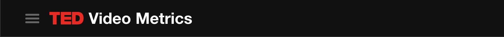
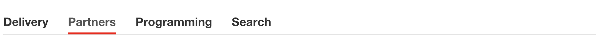

ember-cli-ted-bootstrap
=======================

Include TED Bootstrap and a few bootstrap-related components in your ember-cli project

### Installation

From your project's root, run

```
npm install --save-dev git+ssh://git@github.com/tedconf/ember-cli-ted-bootstrap.git#v0.5.0
```

You'll now have access to TED bootstrap styles/js, and some extra components. See below for details.

## Usage

Refer to [TED bootsrap]() and [Bootstrap 3]() for docs. There are some additional components included.

- [ted-navbar](#ted-navbar)
- [ted-flaps](#ted-flaps)
- [ted-panel](#ted-panel)

<h3 id='ted-navbar'>ted-navbar</h3>

A navbar for the top of your app.



Usage:

```hbs
{{ted-navbar name='Video Metrics'}}
```

<h3 id="ted-flaps">ted-flaps</h3>

A subnav typically used for URL routes within your app.



The list of links comes from a controller property. The component sets the
active class on the link if the route is active.

You can specify a custom label for the route by specifying a `label` key.

Usage:

```js
// controllers/application.js
import Ember from 'ember';

export default Ember.Controller.extend({

  linksMeta: [
    {name: 'delivery'}, // name is the name of a route you've declared in router.js
    {name: 'partners'},
    {name: 'programming'},
    {name: 'talk-lookup', label: 'Search'},
  ]

});
```

```hbs
<!-- /application.hbs -->
{{ted-flaps links=linksMeta}}
```

<h3 id="ted-panel">ted-panel</h3>

A collapsible panel wrapping [Bootstrap's collapsible JS plugin](http://getbootstrap.com/javascript/#collapse).

Works well with standard markup for Bootstrap's panels.

**Usage**

- Add a `.ted-panel-toggle` class on the collapse trigger.
- Add `.ted-panel-collapse .panel-collapse .collapse` classes on the collapsible element.
  - TODO: have ted-panel-collapse automatically extend those classes
  - Optional: add `.in` class to start out open

Bare-bones:

```hbs
{{#ted-panel}}
  <a href="#" class='ted-panel-toggle'>More details</a>
  <div class='ted-panel-collapse panel-collapse collapse'>
    <p>Some more info</p>
  </div>
{{/ted-panel}}  
```

Using Bootstrap's .panel markup:

```hbs
{{#ted-panel classBinding='isExcluded :panel :panel-default'}}
  <div class="panel-heading">
    <h3 class='panel-title'>
      <a href='#' class='ted-panel-toggle'>
        More details
      </a>
    </h3>
  </div>

  <div class="ted-panel-collapse panel-collapse collapse">
    <div class="panel-body">
      <p>Your content</p>
    </div>
  </div>
{{/ted-panel}}
```
